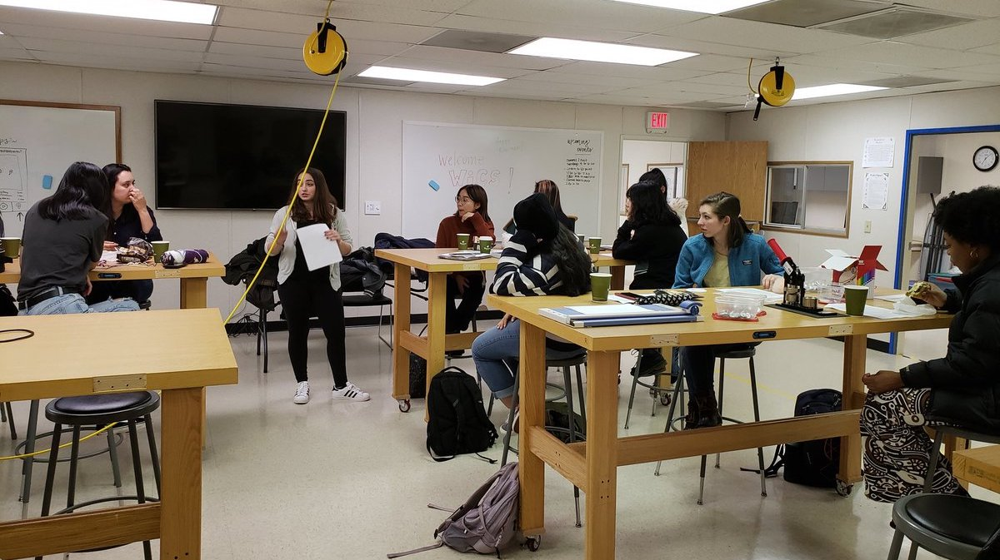
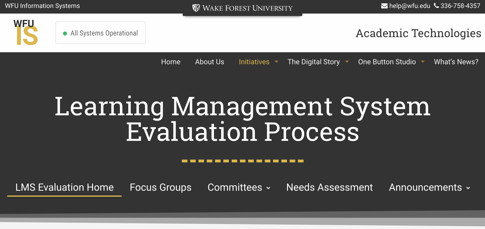
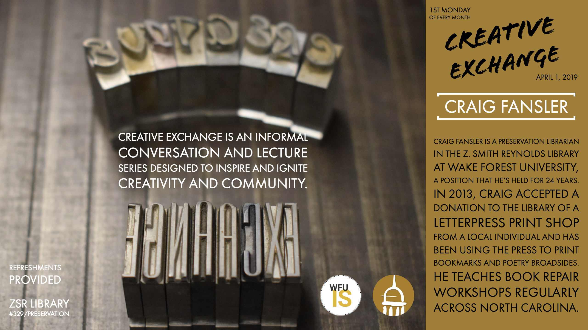
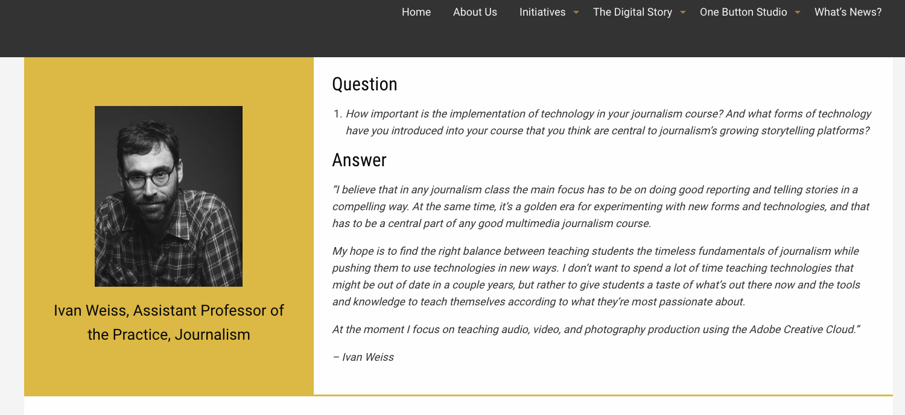

```{r echo = FALSE}
library(tufte)
```

`r newthought("In preparation for")` the Spring 2019 LTC meeting at Duke, [Hannah Inzko](https://is.wfu.edu/academic-technologies/about/), [Brenda Knox](https://oe.wfu.edu/about/), [Paul Whitener](https://is.wfu.edu/academic-technologies/whats-news/wakerspace/), [Allen Brown](https://oe.wfu.edu/about/), and [Brianna Derr](https://is.wfu.edu/academic-technologies/about/)[^1] gathered to discuss what they're talking about on campus with regards to learning technologies. 

*[LTC Update Podcast](https://prod.wp.cdn.aws.wfu.edu/sites/232/2019/03/LTC_update_pod.mp3)*[^t]

<audio controls="controls" src="https://prod.wp.cdn.aws.wfu.edu/sites/232/2019/03/LTC_update_pod.mp3"></audio>

This offered a chance for Hannah and Brenda to still contribute to the meeting in their absences, and for Paul[^wa] to introduce himself to the group. 

```{r fig.margin = TRUE, echo=FALSE}
library(knitr)

```
We encourage you to listen to the pocast for an overview of things happening at Wake, or continue reading below for a more detailed report. 

#Engaging Campus Communities

In recent years, Information Services (IS) and others involved in academic technologies at Wake Forest have been redesigning the structures that exist to engage the institution's communities and stakeholders in a more sustainable manner.[^3]  IS governance has established two types of groups - [Initiative Teams](https://is.wfu.edu/group/initiative-teams/) and [Communities of Interest](https://is.wfu.edu/group/communities-of-interest/) - for addressing community needs and encouraging exploration. Initiative teams are tasked with specific projects or services. While several of these teams already existed on campus,[^4] the restructured governance has provided a more effective path for communicating practices campus wide and establishing policy in areas of cross-institutional interest. Initiative teams target both administrative services[^5] and teaching and learning efforts.[^6]

Communities of Interest engage similarly constructed groups in more open-ended exploration. One example is the [ePortfolio CoI](https://is.wfu.edu/governance/e-portfolio/) which shares best practices from ePortfolio implementations, researches developments in the broader field, and provides feedback on the selection and integration of these tools into programs. This community is currently partnering with the [President's Commission on the First Year Experience](https://leadershipandcharacter.wfu.edu/what-we-do/current-initiatives/) at Wake to identify whether and how ePortfolios might be implemented in support of this program. Another CoI, the Business Analytics and Informatics team, has adopted a new licsensing structure for Microsoft Power BI on campus and is currently rolling out this tool to support teams, programs, and schools in collaborative, data-informed decision making. CoI's are typically open to any faculty and staff at the university. Specific efforts are also being made to involve students as regular participants in these groups

```{r fig.margin = TRUE, echo=FALSE}
library(knitr)

```
##LMS Evaluation

One project that extends beyond these smaller teams is the current [LMS Evaluation](https://is.wfu.edu/academic-technologies/lms-review/), overseen by the Director of Academic Technology. The process, which has been documented publicly, began with a series of conversations that led to structured focus groups (with staff, faculty, and students) and a needs assessment survey delivered to the campus community. The focus group and survey feedback was incorporated into a formal RFP. Proposals received from vendors were evaluated by a representational committee. This committee selected two LMSs to invite for on-campus presentations during the week of March 25th. Representatives for both Sakai and Canvas[^7] will deliver a [series of demonstrations](https://us18.campaign-archive.com/?e=&u=bea1d79e7a99dd4ba1507c539&id=dd32f72c28) open to the entire campus community. While this effort will not preclude further explorations into [Next-Generation Digital Learing Environments](https://er.educause.edu/articles/2017/7/the-ngdle-we-are-the-architects), discusisons of NGDLEs have not been centered in this process.[^8]   

##Creative Exchanges
One effort to engage the broader campus community through a grassroots approach is the Creative Exchanges program. 

```{r fig.margin = TRUE, echo=FALSE}
##Update photo here
library(knitr)

```

Modeled after aspects of [Creative Conversations](https://creativeconversations.us/), Creative Exchanges participants gather at monthly meetings at which individuals across the WFU community (open to anyone engaging in self-defined "creative" work) meet to learn about creative work from a featured member of the WFU community, network with others in the group, and explore potential collaborations (digital or otherwise). The first gathering is scheduled for Monday, April 1st.

#Supporting Evidence Based Practices in Teaching and Learning

A recurring topic in recent WFU updates at LTC has been the emerging Teaching and Learning Collaborative. [Betsy Barre](http://www.elizabethbarre.com/) arrived as the new Executive Director for the collaborative in May of 2018, and she has been engaging the many campus partners throughout the current academic year in establishing a clear vision for the future of the Collaborative. While the vision for this group will likely be finalized in the coming months, two items of note are already clear. First, the Offices of Online Education and Academic Technology will continue to work in partnership with the TLC but will not be joined in a single reporting structure. And second, this new vision will center support for evidence-based practices and scholarship on teaching and learning.

The TLC is currently nearing the end of its search for a postdoctoral research associate. This new hire will be tasked with increasing the Collaborative's capacity for internal program evaluation, institution-level research, and the scholarship of teaching and learning. This one-year position will include a mutual option for a second year with the possibility for it to develop into a permanent staff role. The Director is also working to implement a smoother path to conducting educational research similar to current models established at Duke, Carnegie Mellon, and Rice.[^9] In addition to supporting and growing faculty efforts in educational research, the center is also exploring strategies for engaging the [undergraduate](https://ureca.wfu.edu/) and [graduate student](https://tlc.wfu.edu/what-we-do/postdoc-ta-support/) populations in more of this work as well.

##Learning Analytics
A related area to educational research is the growing body of work on learning analytics. While few individuals at Wake currently classify their work as "learning analytics" research, several current efforts overlap with the field's working definitions.[^10] To that end, the TLC has established a series of exploratory efforts this academic year designed to identify meaningful strategies for supporting  and encouraging individual and interdisciplinary efforts in learning analytics-type work at an institutional level. While many analytic tools might be used to promote this work, the TLC has chosen to ground its work in R and R Studio with the hope that its open availability and relatively accessible development environment will encourage participation, promote interdisciplinary efforts, and develop skills that students, staff, and faculty might continue to use in their efforts beyond Wake. 

The TLC and the Digital Humanities group at Wake have partnered to facilitate a year-long [faculty learning community](https://tlc.wfu.edu/r) on Data Analysis in R for research and learning. While the community's efforts are still taking shape as the process evolves, a significant amount of work has been documented on the [group's website](https://wfu-tlc.github.io/sessions.html). In addition to supporting and developing individual research projects, community participants are providing feedback to inform future efforts targeted at faculty growth in this area. Another partnership has involved a data scientist from Institutional Research to deliver two series of workshops (open to faculty, staff, and graduate students).[^11] These workshops focus more explicitly on the development of technical skills in R and R Studio while fostering community among practitioners on campus. Particular interest from graduate students in these workshops has prompted further discussions about incorporating instruction on SoTL practices into the TLC's TA/PostDoc training. 

Additionally, since learning analytics opens up several ethical and moral concerns around practice, a third effort has begun to identify partners and stakeholders at the university who might work together to develop a code of practice (or similar policy)[^12] around learning analytics efforts here at Wake. Finally, Allen Brown has been engaging with the broader learning analytics community on behalf of the TLC in order to establish Wake Forest's presence[^13] among the broader field while reporting back on existing wisdom and practices from the community to further inform work on this campus. 

#Additional Notes

##Video Management Platform

Academic Technology is leading an effort to identify an institution wide video management platform. While various schools and programs at Wake provide their own platform to support classroom video, streaming, and lecture capture, the VMP committee is reviewing proposals from four vendors[^vmp] with the goal of identifying one platform that can best meet the needs of diverse constituencies across the institution. The team has already reached out to others in the LTC community and welcomes additional insight into video management platforms hosted at other institutions.

##Digital Learning
Brianna Derr, Manager of Advanced Learning Projects, is heading up two new efforts at Wake.[^at] The Technology Consultant program involves undergraduate student workers as part of the Academic Technology team. This year there are four consultants receiving training and mentoring as they complete unique digital projects and deliver workshops and consultations to their peers. Their work helps to extend the digital learning footprint at Wake while developing new student leaders.

```{r fig.margin = TRUE, echo=FALSE}
library(knitr)

```

Brianna is also working to highlight some of the unique instructional projects that faculty have implemented in their classes following consultations with her team. Ivan Weiss partnered with Acadmeic Technology to design a multimedia storytelling assignment for students in a journalism course. The [faculty success story for this project](https://is.wfu.edu/academic-technologies/story/journalism-multimedia-storytelling/) is highlighted online as part of AT's Digital Story effort.[^ds] These highlights provide an overview of the project, a showcase of student work, and reflections from the instructor. These stories serve as a companion to the [Digital Story podcast series](https://is.wfu.edu/academic-technologies/podcasts/), together offering a relatively deep dive into a growing body of interesting digital projects around campus.

##Online Education
As WFU's online efforts continue to grow around the uniersity, the Provost has convened a working group with deans from each school to reevaluate the mission and scope of the university's Office of Online Education. While the office, situated in the Office of the Provost, has always been tasked with a centralized mission, continuing growth in online programs among historically decentralized schools and units has provided an opportunity to clarify this mission and identify functional areas in need of expansion.[^14] The working group is developing strategies for growing the office to better support marketing, enrollment, programmatic and instructional design, accreditation, authorization, and assessment for all of the online programs at the university.

[^wa]: ...and his work with the [Wakerspace](https://twitter.com/WakerSpace), pictured below.
[^1]: You'll hear Brianna's voice on the introduction to the podcast. Many thanks to her for producing this pod.
[^t]: [Transcript](https://prod.wp.cdn.aws.wfu.edu/sites/232/2019/03/LTC-Update-Pod-Edited.pdf)
[^3]: I.e., less personality driven and more strucurally embedded.
[^4]: Such as the [LMS team](https://is.wfu.edu/governance/learning-management-systems/)
[^5]: Including GDPR, Workday implementation, and room reservation management systems (i.e. EMS)
[^6]: The [Learning Spaces](https://is.wfu.edu/governance/learning-spaces/) team, for example.
[^7]: Sakai is the University's current LMS, and will be represented on campus by Longsight. Two online Masters programs currently use Canvas.
[^8]: One current effort exploring NGDLEs on a smaller scale comes from librarian [Kyle Denlinger](https://zsr.wfu.edu/directory/kyle-denlinger/), who is hosting his online course this spring without a traditional LMS.
[^9]: It looks like we will hear more from Duke on [their work](https://mfeldstein.com/educational-research-irb-infrastructure/?elqTrackId=8f8d51420d244c22a9a0235548926b8d&elq=e757e3a03c5b4112ae6267887dac73f8&elqaid=22301&elqat=1&elqCampaignId=10980) in this area.
[^10]: *The measurement, collection, analysis and reporting of data about, and with, learners and their contexts for purposes of understanding and optimizing learning and the environments in which learning occurs (SoLAR, 2011).*
[^11]: Materials from the first workshop series (delivered in Fall 2018) are [available online](https://michaeldewittjr.com/introduction_to_r/lectures.html.
[^12]: One model for such a code and its development is available [from Colorado State University](https://www.csu.edu.au/__data/assets/pdf_file/0007/2160484/2016_CSU_LearningAnalyticsCodePractice.pdf)
[^13]: This includes attendance at IU's first [Learning Analytics Summit](https://lasummit.indiana.edu/) and [LAK19](https://lak19.solaresearch.org), contributions to [OLC Innovate](https://onlinelearningconsortium.org/olc-innovate-2019-session-page/?session=6720&kwds=), and participation in Oregon State's new [eCampus Research Seminar](https://ecampus.oregonstate.edu/research/opportunities/online-teaching-learning-research-seminars/).
[^14]: Paying special attention to balances in centralized support for programs managed both internally & externally.
[^at]: Learn more about Academic Technologies efforts at their [Semester in Review site](https://spark.adobe.com/page/356WBwoJHJCp2/)
[^vmp]: Echo360, Kaltura, Panopto, & WarpWire
[^ds]: [Additional stories are available online](https://is.wfu.edu/academic-technologies/stories/)
